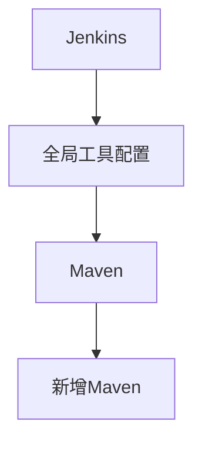



# 持续集成

 &copy;zhouzunchi@gmail.com

> Jenkins
>
> GitLab
>
> Maven
>
> Npm

[TOC]

## Jenkins 使用 GitLab 管理用户认证

* `GitLab Plugin` 、`Gitlab Authentication plugin`插件
* 使用Gitlab的API Token的方式，提前记录好 Token


* 在 Jenkins 中创建 Gitlab 授权
* 点击 `ADD`创建一个Gitlab API Token类型的Crendentials


* 添加完成后点击 Testing 看看是否成功


### 配置用户登录

* 新建Gitlab应用授权


* Jenkins 全局安全配置（这里面可以配置通过 Gitlab 用户认证以及 Gitlab 授权）


* 命令行配置地址


## Jenkins 自由风格项目 


## Jenkins Maven配置

### 配置步骤




> Maven 存在私服地址，可以在 Jenkins 中将 Maven 的配置文件上传上去，如果项目中用到了 Maven 构建，就回去应用项目中使用的 Maven 配置文件；
>
> 配置文件可以是全局或者项目所对应的，在构建的时候应该要去选择的。


```groovy
//Pipline 中应用 Maven 编译实例
stage('Build') {
    steps {
        echo 'Building'
        //应用全局的 Maven 配置
        withMaven(globalMavenSettingsConfig: 'b152d5f3-15f3-4e0f-afe1-2d271dd0e5fc', jdk: 'jdk8u181', maven: 'Maven3.5.4', mavenSettingsConfig: '176f4a20-adee-4072-a29b-5d46dca871df') {
        sh 'mvn clean package -DskipTests=true'
        	}
		}
    }
```


## Jenkins [Publish Over SSH](http://wiki.jenkins-ci.org/display/JENKINS/Publish+Over+SSH+Plugin)

* `Publish Over SSH`插件

## Pipeline [Jenkins Document](https://jenkins.io/doc/book/pipeline/)

> 下面的流程图实在 Jenkins 管道中建立一个 CD 场景的示例


